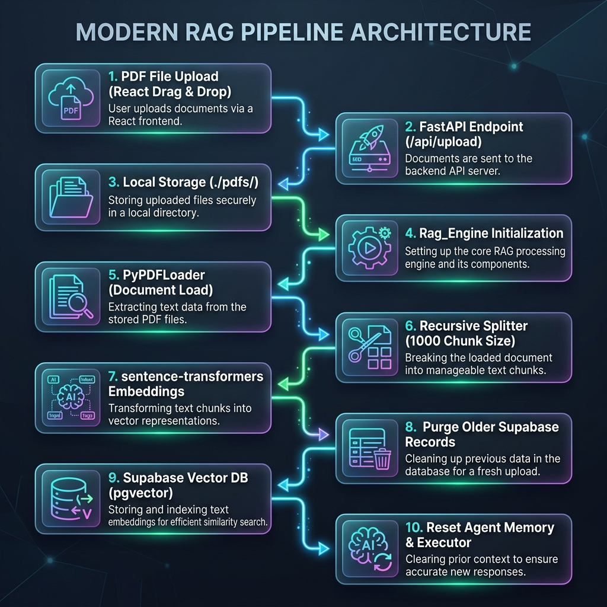

# Chat with PDF - Agentic RAG Core 🚀

An enterprise-grade, agentic PDF chatting application utilizing a **ReAct (Reasoning and Acting) Agent** framework. It ingestion-pipelines documents into a local SQLite-backed Qdrant vector database, calculates embeddings using the Gemini API, and allows users to query documents dynamically with high fidelity in both English and Arabic.

---

## 🏛️ System Architecture

The following diagram illustrates the workflow of the ingestion and chat systems:



---

## 🛠️ Tech Stack
* **Frontend**: React, Vite, CSS (Glassmorphic Dark Palette)
* **Backend**: FastAPI, Python, Poetry (Dependency Management)
* **Vector DB**: Qdrant (SQLite-based local client storage `local_qdrant_db`)
* **AI Model**: Google Gemini API (`gemini-1.5-pro` for Agent, `gemini-embedding-2-preview` for Embeddings)
* **Agent Framework**: LangChain (ReAct Agent Core with custom tool retrieval)
* **Tunnelling**: ngrok (exposing local backend to frontend securely)

---

## ⚡ Key Features
* **Lock-Free Local Ingestion**: Cleaned up collection and updates SQLite database lock-free using a single connection instance.
* **ReAct Agent Loop**: The model automatically reasons whether it needs to fetch context from the PDF database or if the query can be answered directly.
* **Auto-Garbage Collection**: Reclaims and releases SQLite locks immediately when a new document is dropped.
* **High Performance**: Streaming, chunking, and indexing completed in seconds.

---

## 🚀 Setup & Execution

### 1. Prerequisites
Ensure you have the following installed:
* Python 3.11+
* Node.js & npm
* Poetry (Python Package Manager)

### 2. Backend Setup
1. Navigate to the backend directory:
   ```bash
   cd backend
   ```
2. Install Python dependencies:
   ```bash
   poetry install
   ```
3. Create a `.env` file in the `backend/` folder and populate it:
   ```env
   GEMINI_API_KEY=your_gemini_api_key_here
   QDRANT_URL=http://localhost:6333
   QDRANT_COLLECTION_NAME=chat-with-pdf
   LANGSMITH_PROJECT="Chat with PDF"
   ```
4. Run the FastAPI development server:
   ```bash
   poetry run uvicorn app.main:app --host 127.0.0.1 --port 8000
   ```

### 3. ngrok Configuration
Expose the backend port `8000` to the internet to allow the frontend to access it:
```bash
ngrok http 8000
```
Note the ngrok URL (e.g., `https://unsavingly-valvar-jami.ngrok-free.dev`).

### 4. Frontend Setup
1. Navigate to the frontend directory:
   ```bash
   cd frontend
   ```
2. Install Node dependencies:
   ```bash
   npm install
   ```
3. Run the frontend development server:
   ```bash
   npm run dev
   ```
4. Open the frontend URL in your browser (default: `http://localhost:5173/`).
5. Set your Backend configuration URL to the ngrok URL generated in step 3.

---

## 📖 System Walkthrough
1. **Connect**: Open the frontend web app. The connection status should display **Online** (Green).
2. **Ingest**: Drag and drop a PDF file. The ingestion process deletes the existing vector database collection, splits the document into chunks, generates embeddings, and saves them to your local Qdrant SQLite database.
3. **Chat**: Once the status changes to **READY**, send messages. The ReAct agent executor will run a thinking process, call `query_knowledge_base`, and provide an accurate response citing source page numbers.
