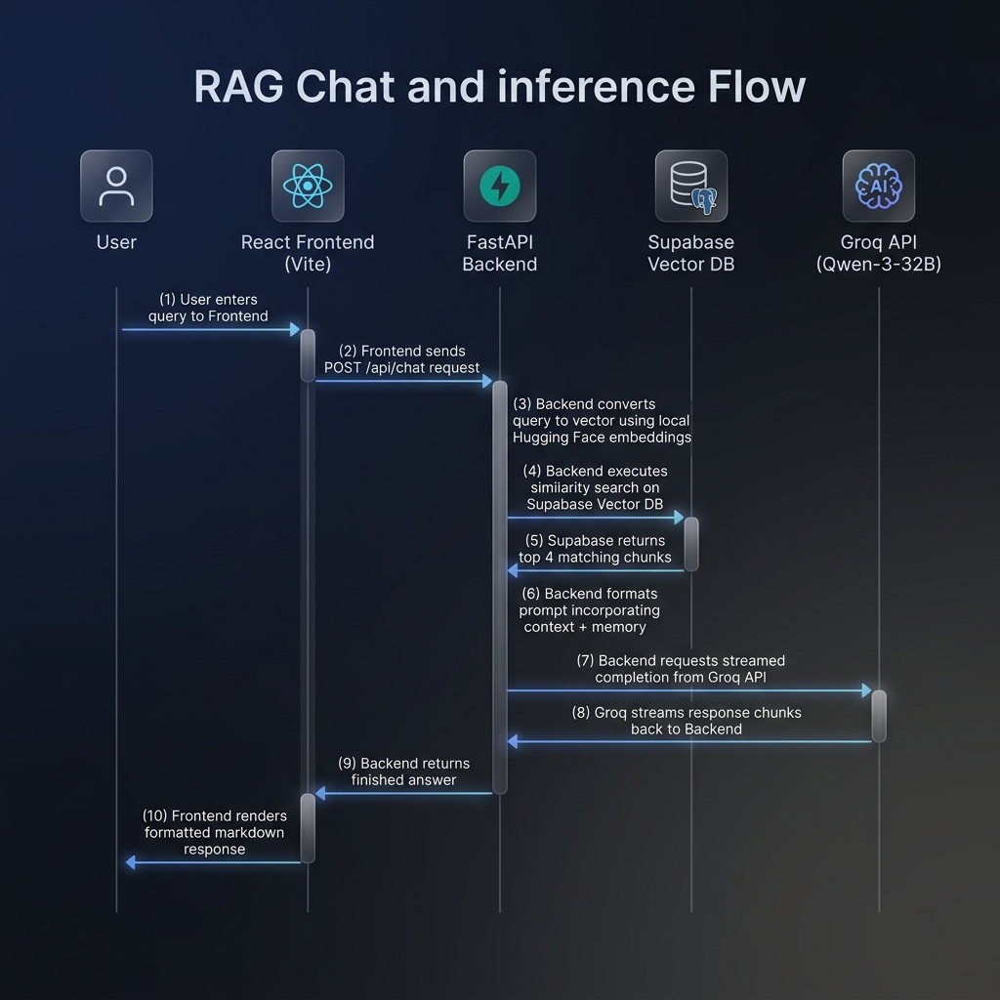
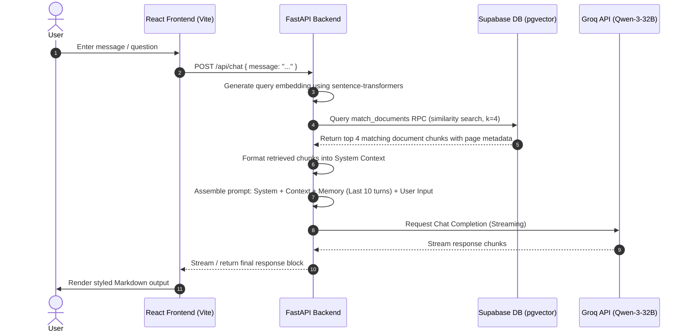

# Chat with PDF - Agentic RAG Core 🚀

An enterprise-grade, lightweight, and high-performance PDF chatting application powered by an **Agentic Retrieval-Augmented Generation (RAG) Core**. It ingests PDF documents, processes and generates vector embeddings locally using the Hugging Face `sentence-transformers/all-MiniLM-L6-v2` model, indexes them in a cloud-based **Supabase Vector Database** (PostgreSQL with `pgvector` extension), and allows users to query documents dynamically using Groq's fast inference engine with the `qwen/qwen3-32b` model.

---

## 🏛️ System Architecture


This application consists of two main workflows: **Document Ingestion** and **Agentic Chatting**.

### 1. Document Ingestion Pipeline
The diagram below details the flow of data from local PDF uploads to vector storage indexing:

```mermaid
flowchart TD
    A[PDF File Upload] -->|React Frontend Drag & Drop| B[FastAPI Endpoint: /api/upload]
    B -->|Save File| C[Local Storage: ./pdfs/]
    B -->|Initialize| D[Rag_Engine Pipeline]
    D -->|Load| E[PyPDFLoader reads PDF]
    E -->|Split| F[RecursiveCharacterTextSplitter\n(Chunk Size: 1000, Overlap: 200)]
    F -->|Local Embeddings| G[sentence-transformers/all-MiniLM-L6-v2\n(384 dimensions)]
    G -->|Purge Old DB Rows| H[Delete old records from Supabase documents table]
    H -->|Index Chunks| I[Supabase Vector DB\n(documents table via pgvector)]
    I -->|Recreate Executor| J[Reset Agent Memory & Recreate SimpleLLMExecutor]
```

### 2. Chat / Inference Flow
The diagram below shows the sequence of actions when a user asks a question about the document:





---

## 📂 Project Directory Structure

```
Chat with PDF/
├── backend/                  # FastAPI Python Backend
│   ├── app/                  # Application Core
│   │   ├── services/         # Business Logic & AI Services
│   │   │   ├── agent_core.py # Core LLM Executor & memory management
│   │   │   ├── agent_prompt.py# Reference ReAct agent prompt templates
│   │   │   └── rag_engine.py # Document parsing, chunking, and indexing
│   │   ├── config.py         # App configurations via Pydantic Settings
│   │   └── main.py           # FastAPI entrypoint and API routers
│   ├── pdfs/                 # Directory holding uploaded PDFs
│   ├── tests/                # Local testing and verification scripts
│   │   ├── test_config.py    # Test environment configuration
│   │   ├── test_full_agent.py# End-to-end local RAG test
│   │   └── test_rag_engine.py# Document ingestion & indexing test
│   ├── .env                  # Backend environment credentials (ignored)
│   ├── .env.example          # Sample environment variables
│   ├── pyproject.toml        # Poetry package dependencies
│   └── poetry.lock           # Poetry lock file
│
├── frontend/                 # React TypeScript Frontend (Vite)
│   ├── src/                  # Source files
│   │   ├── components/       # Interface components
│   │   │   ├── ChatInterface.tsx # Chat interface, markdown renderer, and skeletons
│   │   │   └── Sidebar.tsx   # Sidebar for connection settings, drag & drop uploads, and health indicators
│   │   ├── assets/           # Frontend assets
│   │   ├── App.tsx           # Global state manager and API coordination
│   │   ├── App.css           # Custom styling rules for glassmorphism layout
│   │   ├── main.tsx          # Application entrypoint
│   │   └── types.ts          # TypeScript type declarations
│   ├── tailwind.config.js    # Tailwind styling configurations
│   ├── package.json          # Node dependencies
│   └── README.md             # Frontend specific guidelines
│
├── docs/                     # Static diagrams and media
│   └── images/
│       └── system_architecture.png
└── README.md                 # Project root documentation (this file)
```

---

## 🛠️ Tech Stack & Technical Decisions

* **Frontend**: React, Vite, TypeScript, TailwindCSS, Lucide Icons. Designed with a gorgeous, responsive **Glassmorphic Dark Theme**.
* **Backend**: FastAPI (Python), asynchronous routers, and automatic OpenAPI schema generation.
* **Vector DB**: Supabase (PostgreSQL with `pgvector` extension). **Decision**: Bypasses local SQLite database locking issues (common in containerized/concurrent operations) by offloading vector indexing and retrieval to a scalable, cloud-based PostgreSQL database.
* **Embeddings**: Local Hugging Face Embeddings (`sentence-transformers/all-MiniLM-L6-v2` - 384 dimensions). **Decision**: Runs locally in the backend environment to eliminate third-party embedding API costs, external key setup, and model billing.
* **AI Model**: Groq API using `qwen/qwen3-32b`. Provides high-quality completions, multi-turn reasoning capabilities, and sub-second latency.
* **Memory Management**: The backend `SimpleLLMExecutor` keeps track of the last 10 messages in the chat history, ensuring fluent, context-aware, multi-turn conversation.

---

## ⚡ Key Features
* **Zero-Cost Embeddings**: Leverages local Hugging Face embedding pipelines running entirely on the backend server.
* **Dynamic Context Purging**: Clears older document vectors in Supabase on new PDF uploads, ensuring the agent remains focused on the active document context.
* **Automatic Session Cache**: Persists the configured backend URL in the browser's local storage.
* **Markdown Rendering**: Beautifully formats headers, list items, hyperlinks, code blocks, and page numbers dynamically in the chat bubble.
* **Robust Error Handling**: Friendly warning systems alert the user if the server goes offline or if they attempt to chat before uploading a PDF.

---

## 🚀 Setup & Execution

### 1. Prerequisites
Ensure you have the following installed:
* Python 3.11+
* Node.js & npm
* Poetry (Python Package Manager)

### 2. Supabase Setup
Before running the backend, set up your Supabase database:
1. Go to your **Supabase Dashboard** -> **SQL Editor**.
2. Execute the following SQL script to initialize the tables, enable vector extensions, and create the similarity search RPC function:
   ```sql
   -- 1. Enable the pgvector extension
   create extension if not exists vector;

   -- 2. Drop any old conflict functions if they exist
   drop function if exists match_documents(vector, double precision, integer);
   drop function if exists match_documents(vector, double precision, integer, jsonb);
   drop function if exists match_documents(vector, integer, jsonb);

   -- 3. Create the documents table (384 matches sentence-transformers/all-MiniLM-L6-v2 dimensions)
   create table if not exists documents (
     id bigserial primary key,
     content text,
     metadata jsonb,
     embedding vector(384) 
   );

   -- 4. Create the similarity search function
   create or replace function match_documents (
     query_embedding vector(384),
     match_count int default null,
     filter jsonb default '{}'
   )
   returns table (
     id bigint,
     content text,
     metadata jsonb,
     similarity float
   )
   language plpgsql
   as $$
   begin
     return query
     select
       documents.id,
       documents.content,
       documents.metadata,
       1 - (documents.embedding <=> query_embedding) as similarity
     from documents
     where documents.metadata @> filter
     order by documents.embedding <=> query_embedding
     limit match_count;
   end;
   $$;

   -- 5. Disable Row Level Security (RLS) for simple backend-only access
   alter table documents disable row level security;
   ```

### 3. Backend Setup
1. Navigate to the backend directory:
   ```bash
   cd backend
   ```
2. Install Python dependencies using Poetry:
   ```bash
   poetry install
   ```
3. Create a `.env` file in the `backend/` folder and populate it (use `backend/.env.example` as a template):
   ```env
   GROQ_API_KEY="your_groq_api_key_here"
   SUPABASE_URL="https://your-project-id.supabase.co"
   SUPABASE_KEY="your-supabase-service-role-key"
   LANGSMITH_PROJECT="Chat with PDF"
   LANGSMITH_TRACING=true
   LANGSMITH_ENDPOINT="https://api.smith.langchain.com"
   LANGSMITH_API_KEY="your_langsmith_api_key_here"
   ```
4. Run the FastAPI development server:
   ```bash
   poetry run uvicorn app.main:app --host 127.0.0.1 --port 8000
   ```

### 4. Tunneling via ngrok (Optional/Required for external deployment)
Expose the backend port `8000` to the internet to allow the frontend to access it securely:
```bash
ngrok http 8000
```
Note the ngrok URL (e.g., `https://unsavingly-valvar-jami.ngrok-free.dev`).

### 5. Frontend Setup
1. Navigate to the frontend directory:
   ```bash
   cd frontend
   ```
2. Install Node dependencies:
   ```bash
   npm install
   ```
3. Run the frontend development server:
   ```bash
   npm run dev
   ```
4. Open the frontend URL in your browser (default: `http://localhost:5173/`).
5. Paste your backend URL (e.g. the ngrok URL or `http://127.0.0.1:8000`) in the configuration panel on the sidebar and click **Connect**.

---

## 📖 Walkthrough & Usage Example

1. **Connect**: Enter the FastAPI Backend URL in the sidebar input box. When the indicator light turns **Online (Green)**, your frontend is securely connected to the backend.
2. **Ingest**: Drag and drop a PDF file (e.g., `Transformers.pdf` or any scientific paper) into the dashed upload area.
   - The backend will clear old database data, load and parse your document, split it into chunks, compute 384-dimensional embeddings locally, and upsert them to Supabase.
   - The upload progress bar on the sidebar updates smoothly.
3. **Chat**: Once the status updates to **READY**, the chat interface unlocks.
   - Type a question (e.g., *"What is the self-attention mechanism?"*).
   - The backend runs a similarity query against Supabase, injects context chunks, calls Groq's fast Qwen-3-32B inference model, and streams the styled answer back to the UI.
